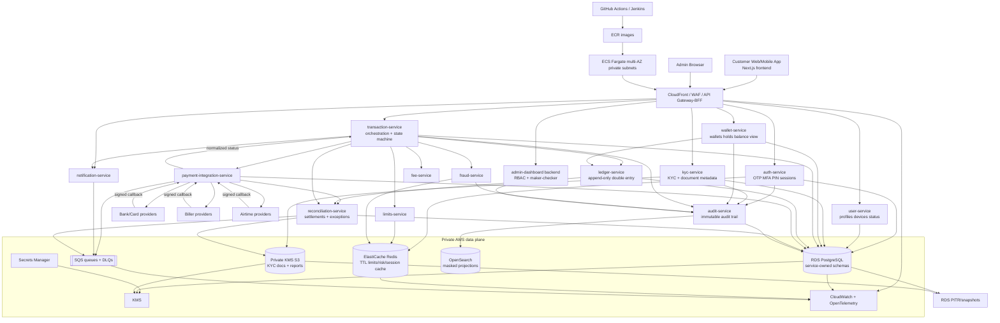
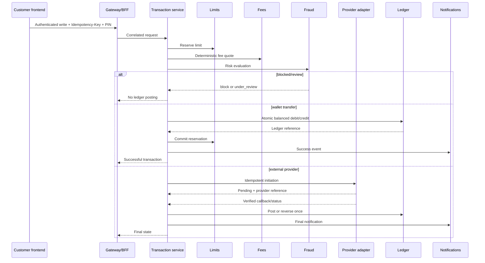

# Full system architecture

The production logical architecture is shown below. The ledger is the financial source of truth; frontend and transaction orchestration never update balances directly.

## Money movement sequence

## Trust and ownership rules

- Browser clients never receive provider, database, AWS, or service credentials.
- The BFF translates secure cookies; backend services remain the authorization authority.
- Transaction-service orchestrates; ledger-service owns posting and reversals.
- Redis is never the source of truth for balances or audit decisions.
- Provider callbacks are signed, replay-protected, deduplicated, normalized, and reconciled.
- Audit records preserve request/correlation, transaction, ledger, provider, settlement, and reconciliation references.
